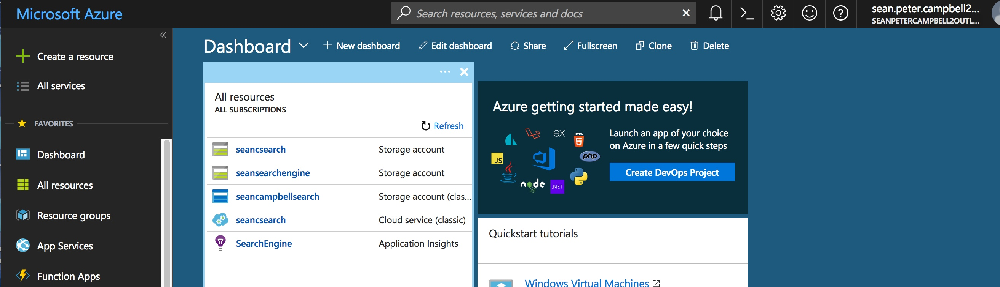
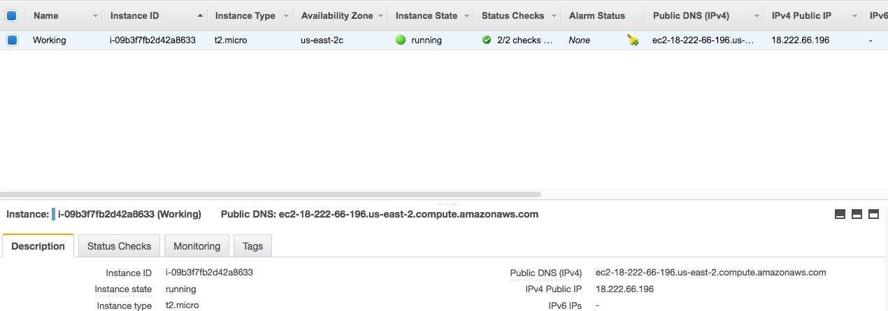
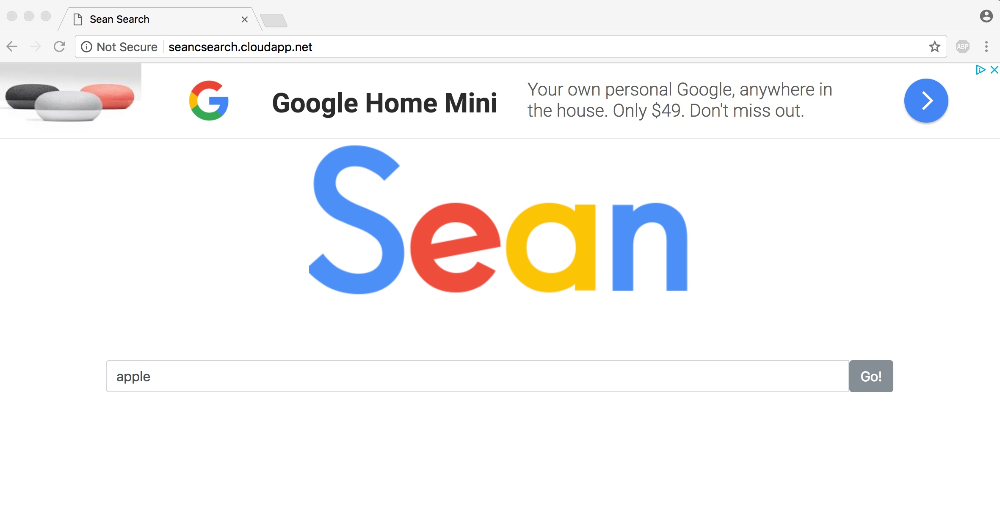

# INFO 344 PA 2
A search engine built off of crawling CNN.com and BleacherReport.com. A special thank you to CK and Chris for all of the help.

## Website Link
[Live Search Website](http://seancampbellsearch.cloudapp.net) feel free to visit ./dashboard to view up to date stats about crawling and errors.

## Screenshots
#### Windows Azure Dashboard

#### Amazon AWS Dashboard

#### Search App index.html

## Write up
End-to-End experience.
- PA1: I had to edit my index.php file so that it only returned results when I had an exact match. I also had to add in special javascript in order to handle the JSONP received from the AWS instance.
- PA2: I actually changed my PA2 the most. I implemented a hybrid list trie that was able to fit the entire wikipedia title dataset in about 400mb. This was fascinating how it effected the speed SO much. Adding the results to the search page just required me using a datalist.
- PA3: I changed the partition key to be every word in the CNN or BleacherReport title. This essentially made my Azure Table an inverted index. When a user searches, each word in the search gets queried against the Azure table. After this is complete I use a linq statement to order by most common link and then by date. This allows for nice relevant search results at incredible speeds.
- PA4: I was able to implement a cache for 100 of the most recent results, and utilized Chris Oh's adsense script to add monetization to my search engine.

## Extra credit write up
1. I was able to complete the Hybrid List Trie after many hours and attempts.
2. I also made my page somewhat pretty with a custom logo, images for the NBA players, and a clean UI for search.
